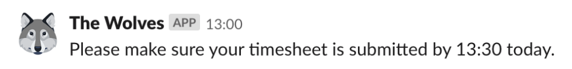
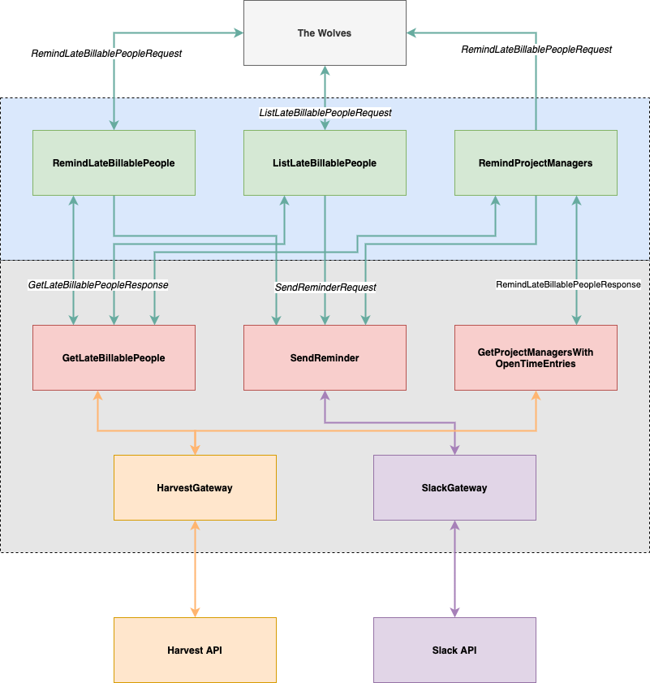

[](https://circleci.com/gh/madetech/the-wolves)

<br />
<p align="center">
  <a href="https://github.com/madetech/the-wolves">
    
  </a>

  <h3 align="center">The Wolves</h3>

  <p align="center">
    A timesheet reminder system.
    <br />
    <br />
    <a href="https://github.com/madetech/the-wolves/issues">Report Bug</a>
    ·
    <a href="https://github.com/madetech/the-wolves/issues">Request Feature</a>
  </p>
</p>

## Table of Contents

- [About the Project](#about-the-project)
  - [Built With](#built-with)
- [Getting Started](#getting-started)
  - [Prerequisites](#prerequisites)
  - [Installation](#installation)
- [Usage](#usage)
- [Deployment](#deployment)

## About The Project

The Wolves is a project developed by the Made Tech Academy of Winter/Spring 2019. It set out to solve the problem of developers not filling in their timesheets on time and the need for the Operations team to manually send reminders.

This application solves this problem by automatically reminding developers that have not submitted their timesheets through a Slack direct message and publicly listing all those yet to do so by the deadline.

<p align="center">
  
</p>

### Built With

- [C# using .NET Core Framework](https://docs.microsoft.com/en-us/dotnet/core/)

### Technical Architecture

The Wolves is a C# application that follows the principles of [Clean Architecture (CA)](https://blog.cleancoder.com/uncle-bob/2012/08/13/the-clean-architecture.html). It is deployed to [Heroku](https://www.heroku.com/) and utilises [Docker](https://www.docker.com/).

<p align="center">
  
</p>

Following CA, we have two sea-level use cases:

- [Remind Late Developers](CryptoTechReminderSystem/UseCase/RemindLateDevelopers.cs)
- [List Late Developers](CryptoTechReminderSystem/UseCase/ListLateDevelopers.cs)

Each of which have use case dependencies on:

- [GetLateDevelopers](CryptoTechReminderSystem/UseCase/GetLateDevelopers.cs) which calls the [Harvest API](https://help.getharvest.com/api-v2/) to figure out who is yet to submit their timesheet
- [SendReminder](CryptoTechReminderSystem/UseCase/SendReminder.cs) which calls the [Slack API](https://api.slack.com/) to send out reminders

We then have `CryptoTechReminderSystem.Main/Program.cs`, which schedules when the
above use cases should be called. The Wolves have two jobs:

- `RemindLateDevelopersJob` which sends a Slack direct message to developers who are
  yet to fill in their timesheets at 10.30 on a Friday morning and then every 30 mins
  until 13:30
- `ListLateDevelopersJob` which sends a Slack message to a public channel that
  lists all the developers still yet to submit their timesheets at 13:30 on a Friday
  afternoon

## Getting Started

To get a local copy up and running follow these simple steps.

### Prerequisites

- [.NET Core 2.2 ](https://dotnet.microsoft.com/download/dotnet-core/2.2)

### Installation

1. Clone the repo

```sh
git clone https://github.com/madetech/the-wolves.git
```

2. Within `the-wolves` directory, restore the dependencies for the application

```sh
dotnet restore
```

## Usage

### Running the application

To locally run the application, there is a set of environment variables that need to be set, see [`CryptoTechReminderSystem.Main/.env-default`](CryptoTechReminderSystem.Main/.env-default).

1. Create a `.env` file within `CryptoTechReminderSystem.Main` and set the following environment variables:

```sh
SLACK_TOKEN=
HARVEST_TOKEN=
HARVEST_ACCOUNT_ID=
HARVEST_USER_AGENT=
SLACK_CHANNEL_ID=
HARVEST_DEVELOPER_ROLES=
SLACK_REMINDER_MESSAGE=
SLACK_LATE_DEVELOPERS_MESSAGE=
SLACK_NO_LATE_DEVELOPERS_MESSAGE=
```

2. Run the application using:

```sh
dotnet run
```

### Running the tests

The application has two namespaced set of tests:

- `CryptoTechReminderSystem.AcceptanceTest` for acceptance tests
- `CryptoTechReminderSystem.Test` for unit tests

To run all tests:

```sh
dotnet test
```

## Deployment

We use [Heroku](https://www.heroku.com) to host our application as a [Heroku Dyno](https://www.heroku.com/dynos). In order to deploy the latest version of the application, we must manually do so using [Heroku CLI](https://devcenter.heroku.com/articles/heroku-cli) and Git.

### Prerequisites

- [Heroku CLI](https://devcenter.heroku.com/articles/heroku-cli)

### Deploying to Heroku with Git

1. Login into Heroku

```sh
heroku login
```

2. Add the remote for the Heroku Git repository for `cryptotech-reminders`

```sh
heroku git:remote -a cryptotech-reminders
```

> You can then confirm that a remote for `Heroku` has been added by running:
> ```sh
> git remote -v
> ```
> The output should then be the following:
> ```sh
> heroku  https://git.heroku.com/cryptotech-reminders.git (fetch)
> heroku  https://git.heroku.com/cryptotech-reminders.git (push)
> origin  git@github.com:madetech/the-wolves.git (fetch)
> origin  git@github.com:madetech/the-wolves.git (push)
> ```

3. Ensuring `master` is up-to-date, deploy the local repository's `master` branch, to Heroku remote

```sh
git push heroku master
```

For more information about deploying to Heroku, see Heroku's guide - [Deploying with Git](https://devcenter.heroku.com/articles/git).
